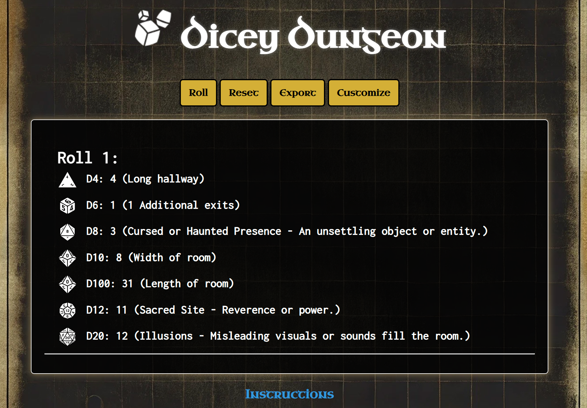

<p align="center">
  
</p>

Dicey Dungeon is a web-based tool designed to generate randomized dungeon scenarios using the full set of Dungeons & Dragons dice. Players can roll dice to determine hallway lengths, room encounters, modifiers, and more, allowing for a dynamic and unpredictable dungeon-crawling experience.

<p align="center">
  
</p>

## Features
- Simple interface for an easy dungeon-building with the ability to disable features.
- Roll up to 7 dice to generate dungeon layouts and room features.
- Customize roll tables for each die to suit your own adventure.
- Export roll history to a text file for easy session record-keeping.
- Save custom roll tables to local storage for personalized play.
- Animated dice results with an optional matching number highlight.
- Room diagram generation with option to download.

## Installation
Clone this repository to your local machine:

```sh
git clone https://github.com/YOUR_USERNAME/DiceyDungeon.git
```

Then, navigate into the project directory:

```sh
cd DiceyDungeon
```

## Usage
To run Dicey Dungeon:
1. Open `index.html` in your preferred browser.
2. Click **Roll** to generate a dungeon section. The results will be displayed, with all relevant dice rolls.
3. Use the **Reset** button to clear the current roll history.
4. Click **Customize** to adjust the roll tables and create your own personalized dungeon experience.
5. The **Export** button allows you to download a text file of all rolls for easy record-keeping.

## Customization
The **Customize** feature allows users to modify the default roll tables for different dice. Changes are stored in the browser’s local storage, so they persist across sessions.
- **Save**: Saves your changes to local storage.
- **Reset**: Reverts a roll table back to its default values.
- **Go Back**: Returns you to the main page, where you can use your customized roll tables.

## Dependencies
- This project uses vanilla JavaScript, HTML, and CSS.
- Audio for the roll sound is located at `audio/rollsound.wav`.
  
## Milestones
- [x] Add a customization page for roll tables.
- [x] Save and load roll history using browser local storage.
- [x] Add more sound effects for rolling specific dice.
- [x] Add Settings panel and toggles (sound,highlight,dice rolls)
- [x] Implement additional room types and random events for even more variety.
- [x] Implement visuals to represent each rooms details.
- [ ] Add proper versioning and Changelog updates

## Contributing
Contributions are welcome! Feel free to submit a pull request or open an issue with ideas, improvements, or bug reports.

## License
This project is licensed under the MIT License. See the `LICENSE` file for details.

## Acknowledgments
- Inspired by classic dungeon-crawling adventures and the unpredictable fun of rolling physical dice.
- Special thanks to all the tabletop role-playing enthusiasts who provided feedback and ideas for this project.
