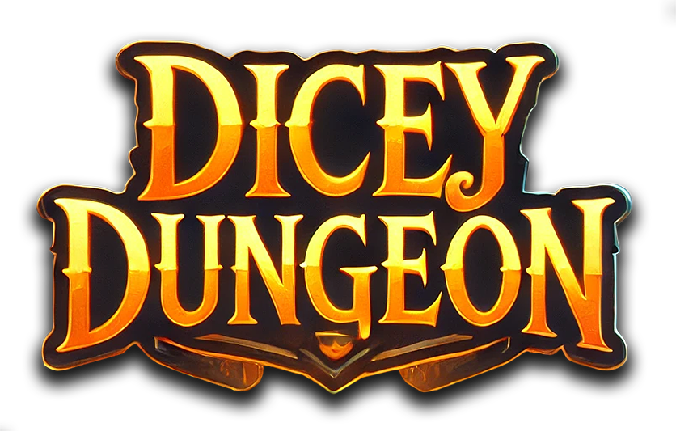

# 🎲 Dicey Dungeon

<div align="center">
  
  
  **A Dynamic Dungeon Room Generator Built by AI**
  
  [Try it Live](https://karuuladue.github.io/DiceyDungeon/index.html) | [View Documentation](./instructions.html) | [Report Issues](https://github.com/yourusername/DiceyDungeon/issues)
</div>

## 🎯 About

Dicey Dungeon is a unique web application born from an experimental collaboration with AI. The entire codebase was generated through interactions with Claude 3.5 Sonnet and ChatGPT 4.0, demonstrating the potential of AI-assisted development while creating a practical tool for tabletop gamers.

This tool generates randomized dungeon room scenarios using a complete set of polyhedral dice, featuring customizable roll tables, dynamic room visualizations, and robust save/load functionality. Whether you're a Dungeon Master seeking quick room setups or a solo player crafting your adventure, Dicey Dungeon streamlines the dungeon creation process.

## ✨ Features

- **Intuitive Interface** - Simple, clean design with toggleable features
- **Complete Dice Set** - Roll D4, D6, D8, D10, D12, D20, and D100 simultaneously
- **Dynamic Room Generation**
  - Automatic sizing and scaling
  - Clear entrance and exit markers
  - 5ft × 5ft grid system
  - Golden-bordered room layouts
- **Customization Options**
  - Modify roll tables for each die
  - Save custom configurations
  - Import/Export functionality
- **Enhanced Experience**
  - Roll history tracking
  - Matching number highlights
  - Optional sound effects
  - Mobile-responsive design

## 🎮 Quick Start
1. Visit the [live demo](https://karuuladue.github.io/DiceyDungeon/index.html)
2. Click **Roll** to generate a dungeon room
3. Use the **Settings** button to customize your experience
4. Click **Edit Tables** to modify roll outcomes
5. Export your history or custom tables as needed

## 🛠️ Installation
For local development:

```bash
# Clone the repository
git clone https://github.com/yourusername/DiceyDungeon.git

# Navigate to project directory
cd DiceyDungeon

# Open in browser
# Simply open index.html in your preferred browser
```

## 📖 How It Works

Each roll generates a complete room scenario using the following dice:

- **D4 ÷ 2**: Determines hallway length in squares
- **D6 ÷ 2**: Sets number of additional exits
- **D8**: Determines room encounters
- **D10**: Establishes room width
- **D12**: Defines room type
- **D20**: Adds room modifiers
- **D100**: Sets room length

## 🎨 Customization

### Roll Tables
Access the customization page to modify roll outcomes:
1. Click **Edit Tables**
2. Modify entries for any die
3. Click **Save** to store your changes
4. Use **Reset** to return to defaults

### Settings
Toggle various features through the settings panel:
- Highlight matching rolls
- Enable/disable sound effects
- Toggle specific dice
- Customize room visualization

## 🤖 AI Development Story

Dicey Dungeon represents a unique experiment in AI-assisted development. The entire application, from concept to implementation, was created through natural language interactions with AI models:

- Architecture and core functionality by Claude 3.5 Sonnet
- Additional features and refinements by ChatGPT 4.0
- Human input limited to requirements and feedback

This approach demonstrates the potential of AI as a collaborative tool in software development while producing a practical, user-friendly application.

## 🔄 Version History

Current Version: 1.3.0
- Complete dice rolling system
- Customizable roll tables
- Enhanced room visualization with hallways
- Mobile-responsive design
- Local storage support
- Export/Import functionality
- Door indicators system
- Grid measurement system

Current Version: 1.0.0
- Complete dice rolling system
- Customizable roll tables
- Room visualization
- Mobile-responsive design
- Local storage support
- Export/Import functionality

View the [CHANGELOG](./CHANGELOG.md) for detailed version history.

## 🤝 Contributing

Contributions are welcome! Feel free to:
- Report bugs
- Suggest new features
- Submit pull requests
- Share your custom roll tables

## 📄 License

This project is licensed under the MIT License - see the [LICENSE](LICENSE) file for details.

## 🙏 Acknowledgments

- Inspired by classic tabletop role-playing games
- Built with feedback from the RPG community
- Powered by Claude 3.5 Sonnet and ChatGPT 4.0
